<div style="width: 100%; background-color: #0e1825; text-align: center; margin-bottom: 20px; padding: 20px 0;">
  
</div>


[![hacs][hacs-default]][hacs-default-link] [![hacs][hacs-validate]][hacs-validate-link]

#   HA Price Timeline Card

A custom Home Assistant Lovelace card that visualizes **hourly energy prices** or **15-minutes energy prices** on a timeline , circle or graph.  
Prices are color-coded in relation to the daily average, so you can quickly spot cheap and expensive hours or slots.  
Supports multiple languages and three different modes and dark&light theme or default theme colors of your current theme

---

## 🚀 Features
Inspired by Tibber, this custom card visualizes **hourly energy prices** on a timeline or circle.

- 📊 Timeline view , circle view or graph view of today's hourly or 15-minutes electricity prices  
- 🎨 Color coding above/below daily average  
- ⏰ Current time highlighted  
- 🌍 Multi-language support
- ⚡ Simple configuration
- 🔄 toggle today / tomorrow


### Timeline mode:
By default, the card shows a **timeline view** of today's electricity prices.  
Each bar represents one hour of the day, colored **turquoise** if the price is below the daily average and **orange** if above.
The current time is highlighted with a marker, while **past hours** are shown faded to provide a quick visual distinction between past and upcoming prices.
A scale below the timeline shows the hours of the day.
With the optional parameters (see below), you can enable either a time adjustment slider or a toggle switch to switch between today and tomorrow views.

- light
  
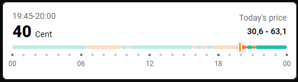 

- dark

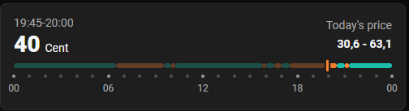 

- with day toggler

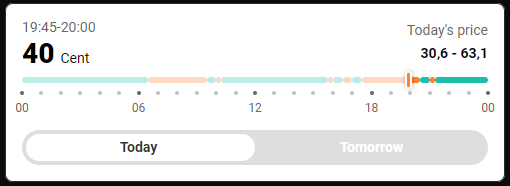 

- with day toggler and slider

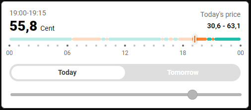 

- with time slider

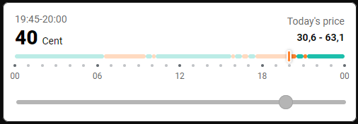 

  
### Circle mode:
If `view: circle` is set, the card switches to a **circle view**.  
The colored ring shows the current price in relation to the minimum and maximum of the day.  
Inside the circle, the current price (in Cent/kWh) and its time range are displayed.

- light

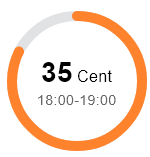 

- dark
  
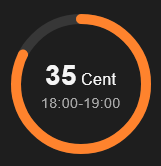 

- with time slider

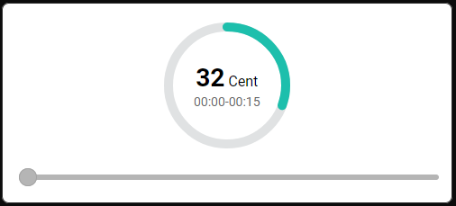 

- with day toggler 

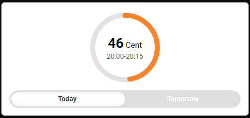 


### Graph mode:
If `view: graph` is set, the card switches to a **graph view**.  
A maximum of two days is displayed (if corresponding data is available). Depending on the date/time and data availability, the graph will either show yesterday on the left and today on the right, or today on the left and tomorrow on the right. If data is available for only one day, the graph will display that single day accordingly. For each day, the minimum and maximum prices are visualized, along with the current time (“now”). The average price and the current hourly price are shown at the top.
In graph mode you can only activate the slider option.

- today & tomorrow

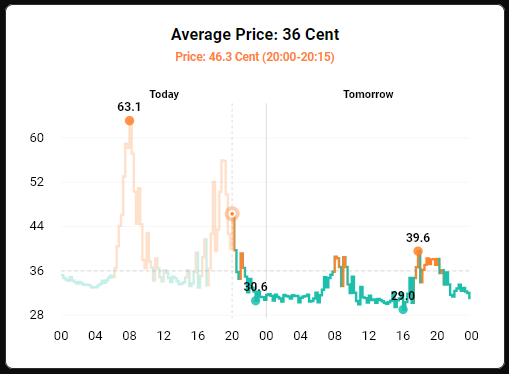 

- today & tomorrow with slider

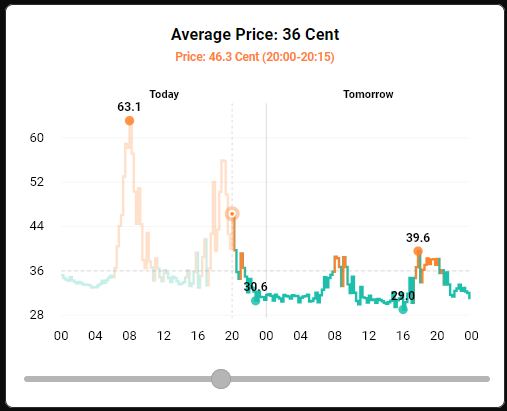 


### Data not available:

When no data is available (or old data) - the no data screen will be shown.

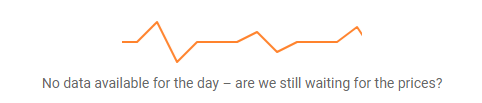 

---

## ⚙️ Installation

### Dependencies
This card is using data from the EPEX Spot add-on:

- [ha_epex_spot](https://github.com/mampfes/ha_epex_spot)  

You can choose between multiple sources:

- Awattar, SMARD.de, Tibber, ....

The price-timeline-card needs the average price and net price / price sensor.

#### tibber integration (!<u>optionally</u>!)
Since the Tibber integration does not directly provide a sensor with hourly or quarter-hourly prices, but instead provides an action to get all prices, we can use this with a little extra effort (the HA Epex Spot addon is then not required).

1. Enable python_script integration
- Open your configuration.yaml
- Add this entry (if it doesn't already exist):
```yaml
python_script:
```
- Restart Home Assistant
- Then check if you have the folder /config/python_scripts/ (if not: create it)
2. Create a Python script
- Create the file set_tibber_prices.py in the folder /config/python_scripts/
```python
# set_tibber_prices.py

entity_id = data.get("entity_id", "sensor.tibber_prices")
state_value = data.get("state", "unknown")
prices_raw = data.get("prices", [])

hass.states.set(
    entity_id,
    state_value,
    {"data": prices_raw}
)
```
3. Create Home Assistant Script
- Go to Settings → Automations & Scenes → Scripts and create a new script.
Or directly in YAML (scripts.yaml):
```yaml
alias: Tibber prices update
sequence:
  - action: tibber.get_prices
    data:
      end: "{{ (now() + timedelta(days=1)).strftime('%Y-%m-%d 23:59:59') }}"
    response_variable: tibber_response
  - variables:
      tibber_prices_raw: "{{ (tibber_response['prices'].values() | list)[0] }}"
      tibber_prices_today: >
          
          
            
          
         {{ ns.list }}
      avg_today: |
        
          {{ (tibber_prices_today | sum / tibber_prices_today | count) | round(2) }}
        
          unknown
        
      tibber_prices_mapped: |
         
          
         {{ ns.list }}
  - data:
      entity_id: sensor.tibber_prices
      state: "{{ avg_today }}"
      prices: "{{ tibber_prices_mapped }}"
    action: python_script.set_tibber_prices
mode: single
```
4. Run script
- Go to Home Assistant → Scripts → Tibber prices update → Run
- After that, the sensor sensor.tibber_prices exists (You can also rename this in the script if you like or if a entity already exists with this name)

After that you should have a sensor `sensor.tibber_prices`.  The state of this sensor is the average today price.
The attributes of this sensor will also have a data array with all the 15-minutes prices for today and if available for tomorrow.

So you could simple use this card then with
```yaml
price: sensor.tibber_prices
timeline: true
theme: light
type: custom:price-timeline-card
```
To ensure that you always have fresh data, you can create an automation that calls the script regularly and at home assistant startup (otherwise the sensor is not available maybe).

### HACS
#### Community Store
The card is available in HACS (Home Assistant Community Store).

[](https://my.home-assistant.io/redirect/hacs_repository/?owner=Neisi&repository=ha-price-timeline-card)

#### Custom Repositories
1. Open HACS  
2. Frontend → top right menu → Custom Repositories → `Neisi/ha-price-timeline-card`  
3. Select type: Dashboard  
4. Install  

### Manual Installation (without HACS)
1. Copy `ha-price-timeline-card.js` to `/config/www/`  
2. Add it in Lovelace:  
```yaml
resources:
  - url: /local/ha-price-timeline-card.js
    type: module
```

### 🛠️ Parameters

Here are the available parameters for this Lovelace card.

### 🔒 Required Parameters

| Name       | Type   | Description |
|------------|--------|-------------|
| `price`   | string | Entity ID of the energy price sensor (must provide `attributes.data` with hourly or 15-minutes prices). |


> **Note:** The `attributes.data` of the `price` sensor must be an array of objects, each containing at least the following keys:
> 
> - `start_time`: ISO 8601 timestamp of the interval start
> - `price_per_kwh`: price in €/kWh
> 
> Example:
> 
> ```yaml
> data:
>   - start_time: "2025-10-05T00:00:00.000+02:00"
>     price_per_kwh: 0.209
>   - start_time: "2025-10-05T00:15:00.000+02:00"
>     price_per_kwh: 0.2087
>   - start_time: "2025-10-05T00:30:00.000+02:00"
> ```
> This format is automatically provided when using the Tibber script above or the `ha_epex_spot` addon.


### Optional
| Name       | Type    | Default | Description |
|------------|---------|---------|-------------|
| `average` | string or number |   `undefined`  | A fix value for average (e.g. 0.25) you want to compare. Or you could pass a Entity ID of the sensor that provides the average price. If you don`t use this average parameter, the card calculates the average itself |
| `view` | string | `timeline`  | Show timeline view (`timeline`) or circle view (`circle`) or graph view (`graph`). |
| `theme`    | string  | `light` | Visual theme. Possible values: `light`, `dark`, `theme` (uses Home Assistant theme variables). |
| `slider`    | boolean  | `false` | Show slider to change time for current day and view |
| `day_switch`    | boolean  | `false` | Show day toggler to change between today and tomorrow (for circle and timeline view only) |
| `start_view`    | string  | `today` | Determines which view is shown by default when the card loads. Possible values: `today`, `tomorrow` |
| `currency` | object | `{ name: "Cent", symbol: "¢" }` | Defines how the unit for energy price is displayed. Use this to customize the currency subunit (e.g., "Cent", "Öre", ...). The `name` is shown as text label. The `symbol` field is currently optional and not yet displayed in all views, but **it is recommended to set it** since it may be used by future features or visualizations. |
---

### 📘 Configuration

The card can be configured either with the code editor or with the visual editor.

#### Manual Configuration with Code Editor

timeline view and light theme (default):
```yaml
type: custom:price-timeline-card
price: sensor.epex_price
```


circle view and dark theme:
```yaml
type: custom:price-timeline-card-test
price: sensor.epex_price
theme: dark
view: circle
```


circle view with slider:
```yaml
type: custom:price-timeline-card
price: sensor.tibber_prices
view: circle
slider: true
```


circle view with slider and custom currency:
```yaml
type: custom:price-timeline-card
price: sensor.tibber_prices
view: circle
slider: true
currency:
  name: Öre
  symbol: öre
```
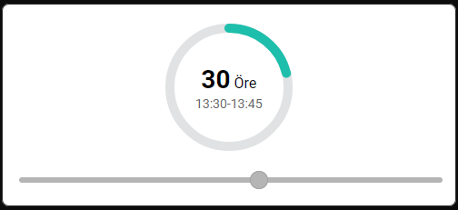

#### Configuration with Visual Editor

The configuration can also be done using the built-in form editor (visual editor).

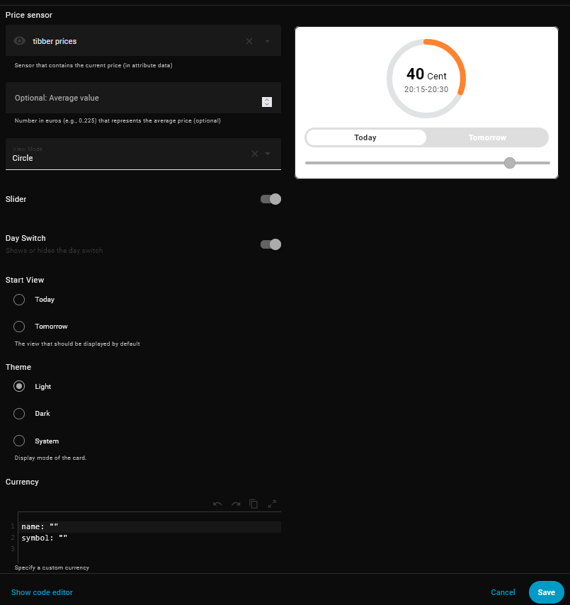

<!--BADGES-->
[hacs-default]: https://img.shields.io/badge/HACS-Default-blue?style=flat&logo=homeassistantcommunitystore&logoSize=auto
[hacs-default-link]: https://my.home-assistant.io/redirect/hacs_repository/?owner=Neisi&repository=ha-price-timeline-card&category=plugin
[hacs-validate]: https://github.com/ngocjohn/lunar-phase-card/actions/workflows/validate.yaml/badge.svg
[hacs-validate-link]: https://github.com/Neisi/ha-price-timeline-card/actions/workflows/validate.yaml